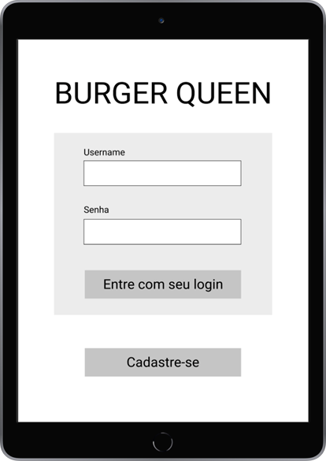
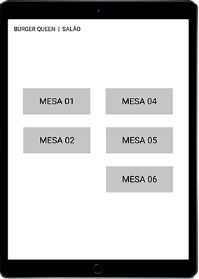

  </img>
  <h1>Hamburgueria Ipê</h1>

### ⚛️ :fork_and_knife:	:iphone: :chart:	 🚀
#### Original,  minimalista e <i>clean</i>

Hamburgueria Ipê é uma aplicação para <i>tablets</i> baseada em  ReactJS, JSX e CSS3.

#### :speaking_head: User Experience (UX)
- Exaustivamente testado para atingir a melhor experiência do usuário
#### :art: Design original
- Identidade visual agradável e de fácil identificação das <i>features</i>
#### 🧩 Componentização
- A aplicação está toda componentizada para fácil manutenção do código
#### 🗂️ Documentação
- Todo o processo está bem documentado para melhor entendimento
#### 📊 Data Science
- Possibilidade de levantar dados para evolução do negócio

***

Acesse nossa aplicação [clicando aqui](http://hamburgueria-ipe.vercel.app/)

## :page_facing_up: Índice

<!--ts-->

- [1. Introdução](#1-introdução)
- [2. A aplicação](#2-a-aplicação)
- [3. Histórias de usuários](#3-histórias-de-usuários)
- [4. Funcionalidades](#4-funcionalidades)
- [5. Processo de criação](#5-processo-de-criação)
- [6. Tecnologias](#6-tecnologias)
- [7. Desenvolvedoras](#7-desenvolvedoras)

<!--te-->

***
## 1. Introdução

**[Hamburgueria Ipê](http://hamburgueria-ipe.vercel.app/)** é uma aplicação *web* escalável, desenvolvida para a gestão de uma hamburgueria com foco em *tablets* e atendendo todas as necessidades de seus usuários.

As premissas partem do desafio [Burger Queen](https://github.com/Laboratoria/SAP005-burger-queen) proposto pela Laboratória.

  

    </img>
  

## 2. A aplicação
A hamburgueria Ipê lançou o serviço 24h e teve um resultado muito positivo. Para manter o crescimento, precisa de uma aplicação *web* pensada para *tablets*, que permita armazenar os pedidos dos cardápios **Principal** e **Café da Manhã**, englobar todos os extras, enviar para a cozinha e informar aos atendentes quando os pedidos podem ser servidos aos clientes.

## 3. Histórias de usuários

O cliente nos forneceu as seguintes histórias de usuário:

:writing_hand: **História de usuário #1**

Eu, como funcionário da hamburgueria:

* Quero entrar na plataforma e ver apenas a tela importante para o meu trabalho

:writing_hand: **História de usuário #2**

Eu, como atendente:

* Quero poder anotar o meu pedido
* Saber o valor de cada produto
* Poder enviar o pedido para a cozinha para ser preparado

:writing_hand: **História de usuário #3**

Eu, como *chef* de cozinha:

* Quero ver os pedidos dos clientes em ordem
* Poder marcar quando os pedidos estão prontos
* Poder notificar os atendentes que o pedido está pronto para ser entregue ao cliente

:writing_hand: **História de usuário #4**

Eu, como atendente:

* Quero ver os pedidos que estão prontos para entregá-los rapidamente aos clientes

## ⚙️ 4. Funcionalidades
Para atender todas as necessidades dos usuários, definimos que a aplicação *web* deve ter as seguintes funcionalidades:

✔️  Criar login e senha

✔️  Registar tipo de usuário conforme área (cozinha ou salão)

✔️  Entrar na tela correta para cada usuário

✔️  Anotar o nome e mesa

✔️  Adicionar produtos aos pedidos

✔️  Excluir produtos

✔️  Ver resumo e o valor total da compra

✔️  Enviar o pedido para a cozinha (armazenar em um banco de dados)

✔️  Funcionar bem e se adequar a um tablet

✔️  Ver os pedidos à medida em que são feitos

✔️  Marcar os pedidos que foram preparados e estão prontos para   serem servidos

✔️  Ver quanto tempo levou para preparar o pedido até ser marcado como concluído

Também foi definido que os dados **devem ficar armazenados**, mesmo após a conclusão do pedido, para que o cliente possa levantar estatísticas no futuro.

## 🎨 5. Processo de criação

#### :clipboard:	Organização 

Utilizamos o método de Kanban no Trello para organizar todo o processo de desenvolvimento da aplicação.

* Definimos padronizações do código
* Divisão de tarefas
* Backlog do Produto e de cada Sprint
* Tempo para entrega de cada tarefa

#### :woman_artist: Identidade Visual

Pensando no nome **Ipê**, optamos por uma paleta de cores que usa os tons da flor Ipê de forma mais suave para tornar a visualização fácil e agradável.

 ### Logo

A partir da definição da paleta de cores, criamos um logotipo adequado a interface visual da hamburgueria.

   

    </img>
  

### Wireframe inicial
Para desenvolver a interface visual da aplicação, utilizamos o Figma.

  

    </img>
  
 
  
  

    </img>
  

 #### Interface Alta Fidelidade

  

    </img>
  

   

    </img>
  

#### Página do menu principal
Atendente executando pedido
 

    </img>
  

  
 

    </img>
  

 
  🔎 Usabilidade

 Realizamos entrevistas e testes com os usuários até chegar na melhor usabilidade da aplicação.
 Em alguns testes, identificamos que:

 ⚠️ Os atendentes precisavam que as cores dos itens mudassem ao realizar pedidos
 
 ✔️ Solução: Criamos input radios que alteram a cor após o clique

## ⚒️ Tecnologias

Hamburgueria Ipê utiliza as seguintes ferramentas:

 **Code:**
 
      

**Planejamento:**

  

## 7. Desenvolvedoras

  

    </img>
  

Hamburgueria Ipê foi orgulhosamente desenvolvido em 4 semanas,  por Akemi Mitsueda e Cris Mantovani, alunas da SAP005 do *bootcamp* da [Laboratória](https://github.com/Laboratoria).
 
 Se você ficou com alguma dúvida, tem sugestões ou quer apenas nos conhecer melhor, por favor, entre em contato :)
 
 

 
 | Akemi Mitsueda                                                             |                            Cris Mantovani               |
 | :-------------------------------------------------------------------------:| :-----------------------------------------------------: |
 |  |                                                                              |
 |   |   |
 

Copyright [year] [fullname]	
