

  </img>
  <h1>Hamburgueria Ipê</h1>

## ⚛️ :fork_and_knife:	:iphone: :chart: 🚀 
### Original,  minimalista e <i>clean</i>

Hamburgueria Ipê é uma aplicação para <i>tablets</i> baseada em  ReactJS, JSX e CSS3.
#### :speaking_head: User Experience (UX)
- Exaustivamente testado para atingir a melhor experiência do usuário
#### :art: Design original
- Identidade visual agradável e de fácil identificação das <i>features</i>
#### 🧩 Componentização
- A aplicação está toda componentizada para fácil manutenção do código
#### 🗂️ Documentação
- Todo o processo está bem documentado para melhor entendimento
#### 📊 Data Science
- Possibilidade de levantar dados para o desenvolvimento do negócio
## :earth_africa: Acesse a aplicação

  </img>

 
<h4> Você pode acessar a aplicação <a href="http://hamburgueria-ipe.vercel.app/">clicando aqui</a> e utilizar um dos logins de teste abaixo:</h4>

| #                     	|             Salão            	|           Cozinha           	|
|:-----------------------:|:----------------------------:	|:---------------------------:	|
| :busts_in_silhouette: 	| salao@hamburgueriaipe.com.br 	| chef@hamburgueriaipe.com.br 	|
| :key:                 	|            123456            	|            123456           	|

 
 ***
## :bookmark_tabs: Índice

<!--ts-->

* [1. O Projeto](#1-o-projeto)
* [2. A aplicação](#2-a-aplicação)
* [3. Histórias de usuários](#3-histórias-de-usuários)
    * [3.1 Funcionalidades](#31-funcionalidades)
* [4. Planejamento](#4-planejamento)
    * [4.1 Organização](#41-organização)
    * [4.2 Fluxograma](#42-fluxograma)
    * [4.3 User Experience](#43-user-experience)
    * [4.4 Wireframe de média fidelidade](#44-wireframe-de-média-fidelidade)
* [5. Identidadade Visual](#5-identidade-visual)
    * [5.1 Paleta de Cores](#51-paleta-de-cores) 
    * [5.2 Tipografia](#52-tipografia)
    * [5.3 Logotipo](#53-logotipo)

<!--te-->
***
## 1. O Projeto
O desafio *Burguer Queen* proposto pela [Laboratória](https://github.com/Laboratoria), é de desenvolver uma interface para uma hamburgueria 24hrs que está em expansão.
Premissas:
- Manter a interface e o estado sincronizados com React
- Ser um SPA (Single Page App)
- Ser responsivo em *tablets*
- Definir a estrutura de pastas e arquivos
- Usar JavaScript (ES6+) para a lógica do projeto

## 2. A aplicação
  

    
    </img>
  

A Hamburgueria Ipê lançou o serviço de 24 horas e foi muito bem aceito pelos clientes. Agora, a prioridade é continuar crescendo sem perder a qualidade.

Para isso, o atendimento deve ser simples e rápido, a cozinha deve ser eficiente e o negócio deve ser gerenciado com base em dados reais e relatórios fáceis de entender.

## 3. Histórias de usuários

A Hamburgueria Ipê nos forneceu as histórias de usuários:

:writing_hand: **História de usuário #1**

  

    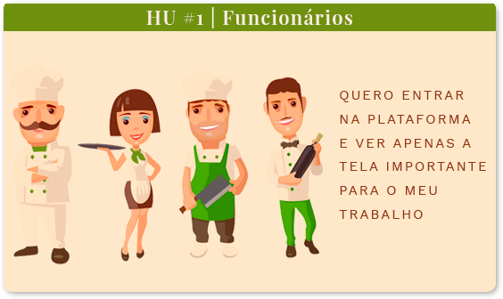
    </img>
  

:writing_hand: **História de usuário #2**

  

    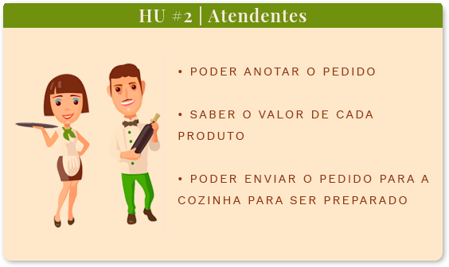
    </img>
  

:writing_hand: **História de usuário #3**

  

    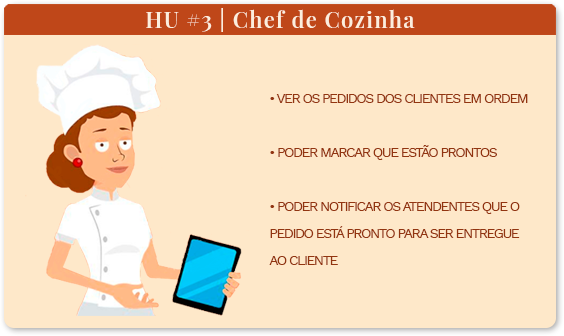
    </img>
  

:writing_hand: **História de usuário #4**

  

    
    </img>
  

  
 ### 3.1 Funcionalidades
Com base nas histórias dos usuários, definimos algumas funcionalidades para a aplicação:

|              HU #1 :heavy_check_mark:              	|           HU #2 :heavy_check_mark:          	|           HU #3 :heavy_check_mark:           	|          HU #4 :heavy_check_mark:          	|
|:--------------------------------------------------:	|:-------------------------------------------:	|:--------------------------------------------:	|:------------------------------------------:	|
|                 Criar login e senha                	|       Anotar nome do cliente e a mesa       	|            Ver os pedidos em ordem           	| Ver a lista de pedidos prontos para servir 	|
| Registar usuário conforme setor (cozinha ou salão) 	| Adicionar e/ou excluir produtos aos pedidos 	| Marcar pedido como 'PRONTO' para ser servido 	|    Marque os pedidos que foram entregues   	|
|            Fazer login na tela correta             	|     Ver resumo e o valor total do pedido    	| Ver o tempo que levou para preparar o pedido 	|                                            	|
|                                                    	|        Enviar o pedido para a cozinha       	|                                              	|                                            	|

##  4. Planejamento
🖍️	Todo o conceito do projeto envolveu uma enorme valorização da experiência do usuário e suas necessidades. Também planejamos e estudamos as opções disponíveis antes de apresentar a solução para a Hamburgueria Ipê.

#### 	4.1 Organização
  
</img>
  

:memo:  Para conseguir entregar todas as funcionalidades do projeto, organizamos todo o fluxo de desenvolvimento do projeto pelo método [Kanban](https://pt.wikipedia.org/wiki/Kanban) no Trello. 

Dessa forma, definimos:

:seedling: [MVP](https://pt.wikipedia.org/wiki/Produto_vi%C3%A1vel_m%C3%ADnimo)

:call_me_hand: Critérios mínimos de aceitação

:label: Padronizações do código ([Code Style](https://en.wikipedia.org/wiki/Programming_style))

:hammer_and_pick:  Divisão de tarefas

🔐 Para *merge* no repositório (*main*), somente após [*code review*](https://en.wikipedia.org/wiki/Code_review) para revisão em pares e aprovação da *reviewer*

🤝 [Daily Scrum](https://www.desenvolvimentoagil.com.br/scrum/daily_scrum)

  

    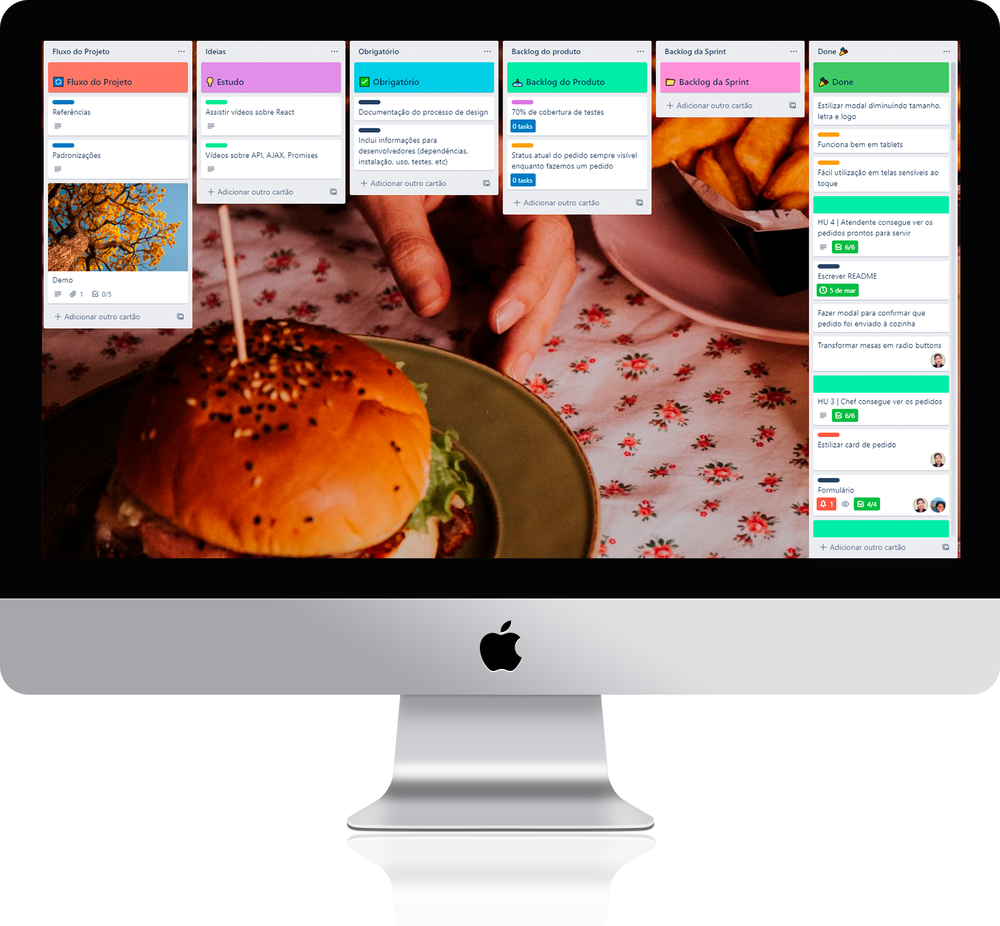
    </img>
    
🔎 *Clique na imagem para ampliar*
  

### 4.2 Fluxograma

🧭 Com as histórias de usuário, conseguimos entender as necessidades da Hamburgueria Ipê e montar o fluxo da aplicação

<a href='app/src/images/readme/fluxograma-zoom.png'>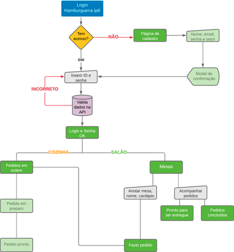</img></a>

🔎 *Clique na imagem para ampliar*
 

 

### 4.3 User Experience
🤩	Durante o processo de criação, fizemos diversas entrevistas com usuários para começar a desenvolver o [*wireframe*](https://pt.wikipedia.org/wiki/Website_wireframe) de média fidelidade no [Figma](https://www.figma.com/) e atender as necessidades do usuário entregando uma boa experiência.

:warning:	As entrevistas foram realizadas por vídeo conferência devido a pandemia do Coronavírus.

### 4.4 Wireframe de média fidelidade
🔰 Com as respostas dos usuários, conseguimos desenvolver e testar o protótipo de média fidelidade, que pode ser acessado [clicando aqui](https://www.figma.com/proto/5rVNETEzDOLBWddlkh2iUo/Hamburgueria-Ip%C3%AA?node-id=1%3A2&scaling=min-zoom).

  

    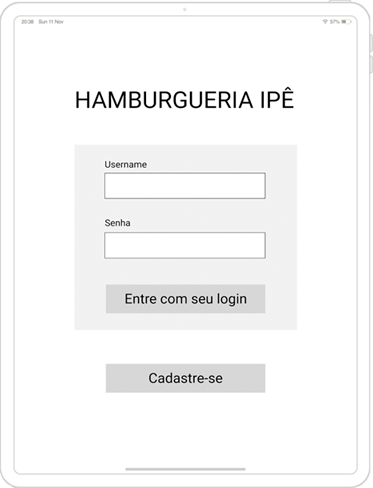</img> 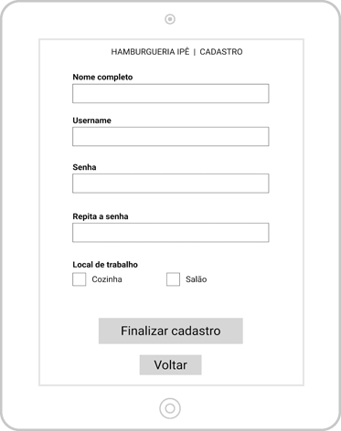</img>
     
    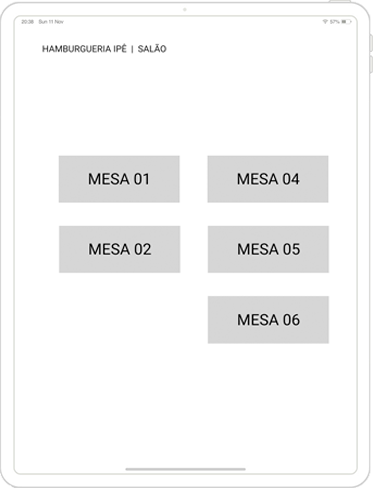</img> 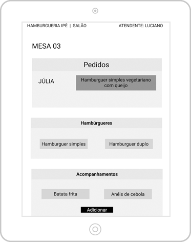</img>
    
🔎 *Clique nas imagens para ampliar*
  
 

## 5. Identidade Visual
🖌️ O conceito da identidade visual da hamburgueria envolve as cores do Brasil e da árvore símbolo [Ipê Amarelo](https://pt.wikipedia.org/wiki/Handroanthus_albus) e sua flor:

  
  </img>

### 5.1 Paleta de Cores
👩‍🎨 A paleta de cores foi desenvolvida com tons de verde e amarelo  presentes na bandeira do Brasil e da flor Ipê, e, alguns tons terrosos como da árvore

Fizemos entrevistas com os usuários para alcançarmos tons que entregassem a melhor e mais agradável visualização.

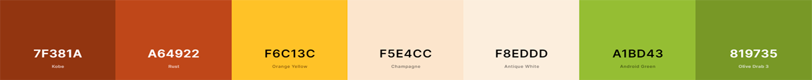

🔎 *Clique na imagem para ampliar*

### 5.2 Tipografia
✒️ Testamos e escolhemos três fontes para serem utilizadas na aplicação e em todos os meios de comunicação, como banners, *posts* em redes sociais, cartazes, etc.

**Tipografia principal**

A fonte [Playfair Display](https://fonts.google.com/specimen/Playfair+Display?preview.text_type=custom&preview.text=Playfar%20Display) é utilizada no logo e em títulos de páginas

  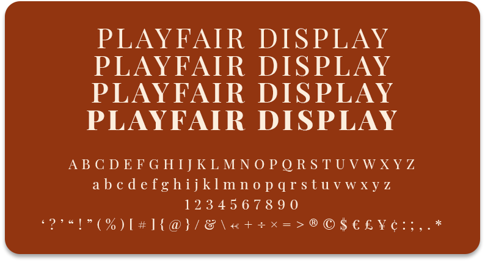
  </img>

**Tipografia de apoio**

A fonte [Work Sans](https://fonts.google.com/specimen/Work+Sans?preview.text_type=custom&preview.text=Work%20Sans%20Regular#standard-styles) é utilizada em todo o corpo da aplicação

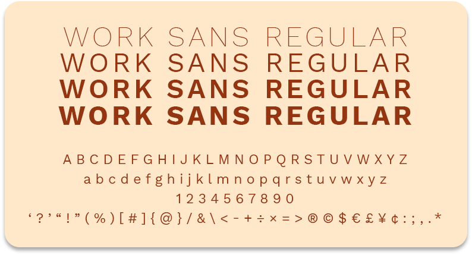</img>

### 5.3 Logotipo

💎 Após a definição da paleta de cores e tipografia, desenvolvemos o logotipo da hamburgueria para ser original, clean e harmônico com todo o visual da aplicação.

O logo lembra uma mesa de madeira e a cor predominante é marrom (RGB #7F381A), inspirado no tronco da árvore.
Ao centro, está a flor Ipê que dá nome a hamburgueria, rodeada pelas palavras 'Hamburgueria' e 'Ipê', em tom amarelo-creme (RGB #F8E7C9).

   

    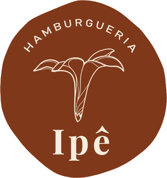</img>
  
 

Desenvolvemos quatro versões para serem aplicadas em fundos de cores distintas:

   

    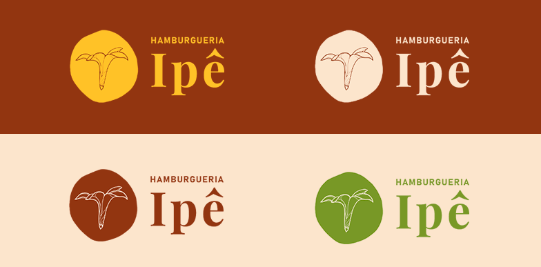</img>
  
 

⚠️**Utilização do logotipo**

🟢 Deve ser usado respeitando a paleta de cores, formas e tamanhos, para ter consistência no uso e desenvolver o reconhecimento da marca pelo público.

🚫 O logo  deve ser usado respeitando a identidade visual, mantendo os padrões de cores Pantone ou CMYK para impressos no geral e RGB para aplicações digitais.

 #### Interface Alta Fidelidade

  

    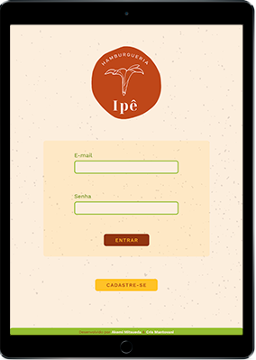
    </img>
  

   

    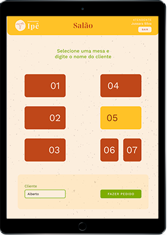
    </img>
  

#### Página do menu principal
Atendente executando pedido
 

    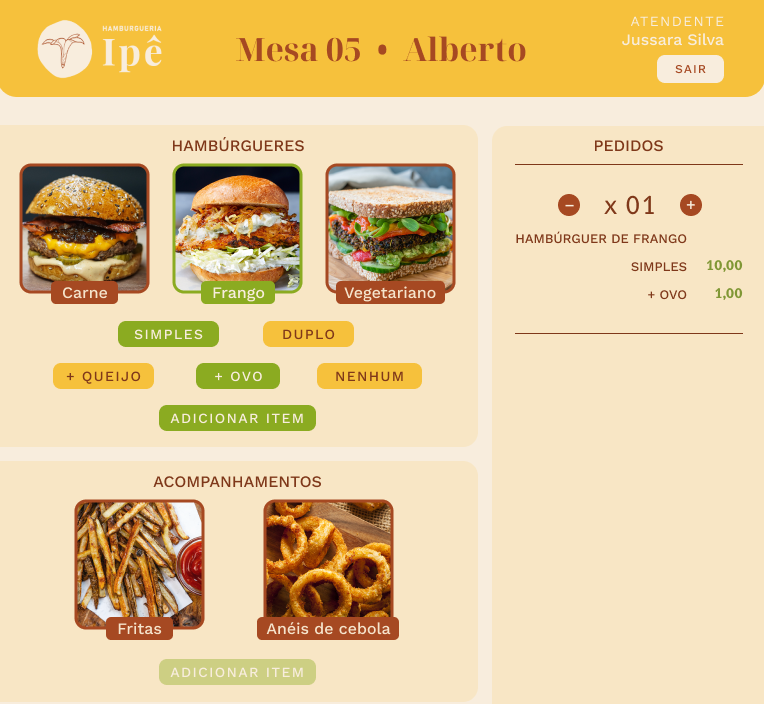
    </img>
  

  
 

    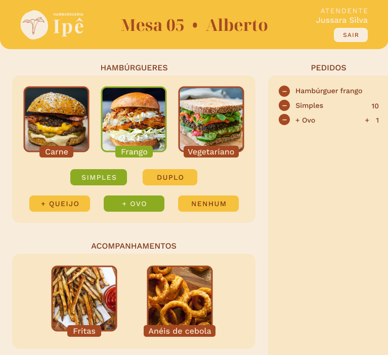
    </img>
  

 
  🔎 Usabilidade

 Realizamos entrevistas e testes com os usuários até chegar na melhor usabilidade da aplicação.
 Em alguns testes, identificamos que:

 ⚠️ Os atendentes precisavam que as cores dos itens mudassem ao realizar pedidos
 
 ✔️ Solução: Criamos input radios que alteram a cor após o clique

## ⚒️ Tecnologias

Hamburgueria Ipê utiliza as seguintes ferramentas:

**Code:**

     

**Planejamento:**

[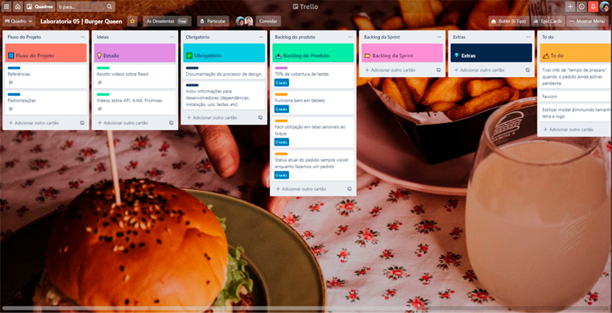](https://trello.com/)  

## 7. Desenvolvedoras

  

    
    </img>
  

Hamburgueria Ipê foi orgulhosamente desenvolvido em 4 semanas,  por Akemi Mitsueda e Cris Mantovani, alunas da SAP005 do *bootcamp* da [Laboratória](https://github.com/Laboratoria).
 
 Se você ficou com alguma dúvida, tem sugestões ou quer apenas nos conhecer melhor, por favor, entre em contato :)
 
 

|                              Akemi Mitsueda                             	      |                                 Cris Mantovani                                 	|
|:------------------------------------------------------------------------------: |:------------------------------------------------------------------------------:	|
|</img> | </img> 	|
| <a href='https://github.com/akemimeka'></img></a> <a href='https://www.linkedin.com/in/akemimeka/'></img></a>  |  <a href='https://github.com/crismantovani'></img></a> <a href='https://www.linkedin.com/in/crissmantovani/'></img></a> 	|          	|

### ©2021 - Todos os direitos reservados
É expressamente proibida qualquer forma de cópia e/ou reprodução deste projeto sem autorização expressa.
