<div align="center" id='topo'>
  </img>
  <h1>Hamburgueria Ipê</h1>

## ⚛️ :fork_and_knife:	:iphone: :chart: 🚀 
### Original,  minimalista e <i>clean</i>
</div>

Hamburgueria Ipê é uma aplicação para <i>tablets</i> baseada em  ReactJS, JSX e CSS3.
#### :speaking_head: User Experience (UX)
- Exaustivamente testado para atingir a melhor experiência do usuário
#### :art: Design original
- Identidade visual agradável e de fácil identificação das <i>features</i>
#### 🧩 Componentização
- A aplicação está toda componentizada para fácil manutenção do código
#### 🗂️ Documentação
- Todo o processo está bem documentado para melhor entendimento
#### 📊 Data Science
- Possibilidade de levantar dados para o desenvolvimento do negócio
## :earth_africa: Acesse a aplicação
<div align="center">
  </img>
</div>

<br/>
<h4> Você pode acessar a aplicação <a href="http://hamburgueria-ipe.vercel.app/">clicando aqui</a> e utilizar um dos logins de teste abaixo:</h4>

<div align='center'>


| #                     	|             Salão            	|           Cozinha           	|
|:-----------------------:|:----------------------------:	|:---------------------------:	|
| 🆔	| salao@hamburgueriaipe.com.br 	| chef@hamburgueriaipe.com.br 	|
| :key:                 	|            123456            	|            123456           	|

</div>
 
 ***
## :bookmark_tabs: Índice

- [1. O Projeto](#1-o-projeto)
- [2. A aplicação](#2-a-aplicação)
- [3. Histórias de usuários](#3-histórias-de-usuários)
  * [3.2 Funcionalidades](#funcionalidades)
- [4. Planejamento](#4-planejamento)
  * [4.2 Organização](#42-organização)
  * [4.3 Fluxograma](#43-fluxograma)
  * [4.4 User Experience](#44-user-experience)
  * [4.5 Wireframe de média fidelidade](#45-wireframe-de-média-fidelidade)
- [5. Identidade Visual](#5-identidade-visual)
  * [5.2 Paleta de Cores](#52-paleta-de-cores)
  * [5.3 Tipografia](#53-tipografia)
  * [5.4 Logotipo](#54-logotipo)
- [6. User Interface](#ux-ui)
  * [6.2 Feedback & Melhorias](#feedback-melhorias)
- [7. Desenvolvimento](#7-desenvolvimento)
  * [7.2 Interface Final](#72-interface-final)
  * [7.3 Valor do produto](#roi)
  * [7.4 Próximos passos](#futuro)
- [8. Tecnologias](#8-tecnologias)
- [9. Desenvolvedoras](#9-desenvolvedoras)
- [10. Licença](#10-licença)

***
## 1. O Projeto
O desafio *Burguer Queen* proposto pela [Laboratória](https://github.com/Laboratoria), é de desenvolver uma interface para uma hamburgueria 24hrs que está em expansão.
Premissas:
- Manter a interface e o estado sincronizados com React
- Ser um SPA (Single Page App)
- Ser responsivo em *tablets*
- Definir a estrutura de pastas e arquivos
- Usar JavaScript (ES6+) para a lógica do projeto

<p align='right'><a href='#topo'>🚀 Voltar ao topo</a></p>

## 2. A aplicação
  <div align="center">
    
    </img>
  </div>
A Hamburgueria Ipê lançou o serviço de 24 horas e foi muito bem aceito pelos clientes. Agora, a prioridade é continuar crescendo sem perder a qualidade.

Para isso, o atendimento deve ser simples e rápido, a cozinha deve ser eficiente e o negócio deve ser gerenciado com base em dados reais e relatórios fáceis de entender.

<p align='right'><a href='#topo'>🚀 Voltar ao topo</a></p>

## 3. Histórias de usuários

A Hamburgueria Ipê nos forneceu as histórias de usuários:

:writing_hand: **História de usuário #1**

  <div align="center">
    
    </img>
  </div>

:writing_hand: **História de usuário #2**

  <div align="center">
    
    </img>
  </div>

:writing_hand: **História de usuário #3**

  <div align="center">
    
    </img>
  </div>

:writing_hand: **História de usuário #4**

  <div align="center">
    
    </img>
  </div>
  
  <div id='funcionalidades'>
  
 ### 3.2 Funcionalidades
 </div>
Com base nas histórias dos usuários, definimos algumas funcionalidades para a aplicação:

|              HU #1 :heavy_check_mark:              	|           HU #2 :heavy_check_mark:          	|           HU #3 :heavy_check_mark:           	|          HU #4 :heavy_check_mark:          	|
|:--------------------------------------------------:	|:-------------------------------------------:	|:--------------------------------------------:	|:------------------------------------------:	|
|                 Criar login e senha                	|       Anotar nome do cliente e a mesa       	|            Ver os pedidos em ordem           	| Ver a lista de pedidos prontos para servir 	|
| Registar usuário conforme setor (cozinha ou salão) 	| Adicionar e/ou excluir produtos aos pedidos 	| Marcar pedido como 'PRONTO' para ser servido 	|    Marque os pedidos que foram entregues   	|
|            Fazer login na tela correta             	|     Ver resumo e o valor total do pedido    	| Ver o tempo que levou para preparar o pedido 	|                                            	|
|                                                    	|        Enviar o pedido para a cozinha       	|                                              	|                                            	|

<p align='right'><a href='#topo'>🚀 Voltar ao topo</a></p>

##  4. Planejamento
🖍️	Todo o conceito do projeto envolveu uma enorme valorização da experiência do usuário e suas necessidades. Também planejamos e estudamos as opções disponíveis antes de apresentar a solução para a Hamburgueria Ipê.

#### 	4.2 Organização
  <div align='center'></img>
  </div>

:memo:  Para conseguir entregar todas as funcionalidades do projeto, organizamos todo o fluxo de desenvolvimento do projeto pelo método [Kanban](https://pt.wikipedia.org/wiki/Kanban) no Trello. 

Dessa forma, definimos:

:seedling: [MVP](https://pt.wikipedia.org/wiki/Produto_vi%C3%A1vel_m%C3%ADnimo)

:call_me_hand: Critérios mínimos de aceitação

:label: Padronizações do código ([Code Style](https://en.wikipedia.org/wiki/Programming_style))

:hammer_and_pick:  Divisão de tarefas

🔐 Para *merge* no repositório (*main*), somente após [*code review*](https://en.wikipedia.org/wiki/Code_review) para revisão em pares e aprovação da *reviewer*

🤝 [Daily Scrum](https://www.desenvolvimentoagil.com.br/scrum/daily_scrum)

  <div align='center'>
    
    </img>
 
  🔎 *Clique na imagem para ampliar*
  </div>

### 4.3 Fluxograma

🧭 Com as histórias de usuário, conseguimos entender as necessidades da Hamburgueria Ipê e montar o fluxo da aplicação

<div align='center'>
<a href='app/src/images/readme/fluxograma-zoom.png'></img></a>

🔎 *Clique na imagem para ampliar*
 </div>
 

### 4.4 User Experience
🤩	Durante o processo de criação, fizemos diversas entrevistas com usuários para ter uma base mais sólda sobre o que eles esperavam e compreender melhor suas necessidades.

Começamos a desenvolver o [*wireframe*](https://pt.wikipedia.org/wiki/Website_wireframe) de média fidelidade no [Figma](https://www.figma.com/) e atender as necessidades do usuário entregando uma boa experiência.

:warning:	As entrevistas foram realizadas por vídeo conferência devido a pandemia do Coronavírus.

### 4.5 Wireframe de média fidelidade

<div align='center'>
  
  </img>
 </div>

🔰 Com as respostas dos usuários, conseguimos desenvolver e testar o protótipo de média fidelidade, que pode ser acessado [clicando aqui](https://www.figma.com/proto/5rVNETEzDOLBWddlkh2iUo/Hamburgueria-Ip%C3%AA?node-id=1%3A2&scaling=min-zoom).

  <div align="center">
    </img> &nbsp; </img>
    <br/><br/>
    </img> &nbsp; </img>
    
🔎 *Clique nas imagens para ampliar*
  </div> 
  
  <p align='right'><a href='#topo'>🚀 Voltar ao topo</a></p>

## 5. Identidade Visual
🖌️ O conceito da identidade visual da hamburgueria envolve as cores do Brasil e da árvore símbolo [Ipê Amarelo](https://pt.wikipedia.org/wiki/Handroanthus_albus) e sua flor:

<div align='center'>
  
  </img>
</div>

### 5.2 Paleta de Cores
👩‍🎨 A paleta de cores foi desenvolvida com tons de verde e amarelo  presentes na bandeira do Brasil e da flor Ipê, e, alguns tons terrosos como da árvore

Fizemos entrevistas com os usuários para alcançarmos tons que entregassem a melhor e mais agradável visualização.


🔎 *Clique na imagem para ampliar*

### 5.3 Tipografia
✒️ Testamos e escolhemos duas fontes para serem utilizadas na aplicação e em todos os meios de comunicação, como banners, *posts* em redes sociais, cartazes, etc.

**Tipografia principal**

A fonte [Playfair Display](https://fonts.google.com/specimen/Playfair+Display?preview.text_type=custom&preview.text=Playfar%20Display) é utilizada no logo e em títulos de páginas

<div align='center'>
  
  </img>
</div>
<br/>

**Tipografia de apoio**

A fonte [Work Sans](https://fonts.google.com/specimen/Work+Sans?preview.text_type=custom&preview.text=Work%20Sans%20Regular#standard-styles) é utilizada em todo o corpo da aplicação

<div align='center'>
</img>
</div>

### 5.4 Logotipo

💎 Após a definição da paleta de cores e tipografia, desenvolvemos o logotipo da hamburgueria para ser original, clean e harmônico com todo o visual da aplicação.

O logo lembra uma mesa de madeira e a cor predominante é marrom (RGB #7F381A), inspirado no tronco da árvore.
Ao centro, está a flor Ipê que dá nome a hamburgueria, rodeada pelas palavras 'Hamburgueria' e 'Ipê', em tom amarelo-creme (RGB #F8E7C9).

   <div align="center">
    </img>
  </div
<br/><br/>

Desenvolvemos quatro versões para serem aplicadas em fundos de cores distintas:

   <div align="center">
    </img>
  </div>
<br/><br/>

⚠️**Utilização do logotipo**

🟢 Deve ser usado respeitando a paleta de cores, formas e tamanhos, para ter consistência no uso e desenvolver o reconhecimento da marca pelo público.

🚫 O logo  deve ser usado respeitando a identidade visual, mantendo os padrões de cores Pantone ou CMYK para impressos no geral e RGB para aplicações digitais.

<p align='right'><a href='#topo'>🚀 Voltar ao topo</a></p>

<div id='ux-ui'/>

## 6. User Interface (e mais um pouco de UX)

<div align='center'>
  
  </img>
 </div>
<br/>

⚖️ Desde o começo do projeto, a experiência do usuário sempre foi uma de nossas prioridades.
Nessa fase do era o momento de equilibrar UX & UI ([*User Interface*](https://medium.com/aela/qual-a-diferen%C3%A7a-entre-ux-e-ui-design-entenda-de-uma-vez-95b4aeb68479)) ainda mais. Dessa forma, aumentamos consideravelmente as chances de entregar uma aplicação de visual agradável e extremamente funcional!

**Principais objetivos de UI**

✔️	Leitura clara de todos os textos

✔️	Consistência e padrões para não confundir os usuários

✔️	Design minimalista

✔️	Eficiência

✔️	Navegação intuitiva

✔️	Reconhecer ícones, formas, imagens e funcionalidades ao invés de lembrar após várias utilizações

✔️	Responsivo em *tablets*

✔️	Liberdade e controle do usuário

✔️	Feedbacks instântaneos para todas as ações (erros, confirmações, etc.)

✔️	Prevenção de erros (prever as ações de descuido do usuário)

<br/>

🗣️ As primeiras conversas com os usuários foram um norte para chegarmos até essa fase. Mas era necessário ouvi-los mais algumas vezes para elevar a UX para outro nível!

Voltamos ao Figma , criamos um wireframe de média fidelidade, que pode ser acessado [clicando aqui](https://www.figma.com/proto/5rVNETEzDOLBWddlkh2iUo/Hamburgueria-Ip%C3%AA?node-id=20%3A3&scaling=min-zoom), e usamos ele para uma nova série de entrevistas.

<div align="center">
  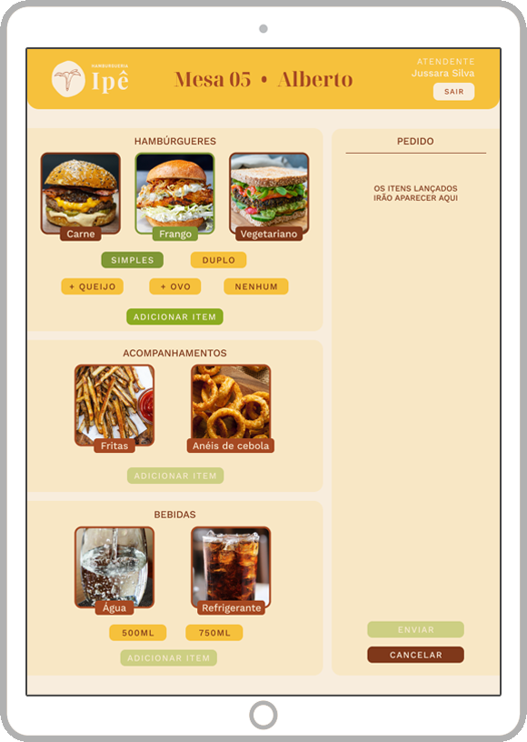</img> &nbsp; 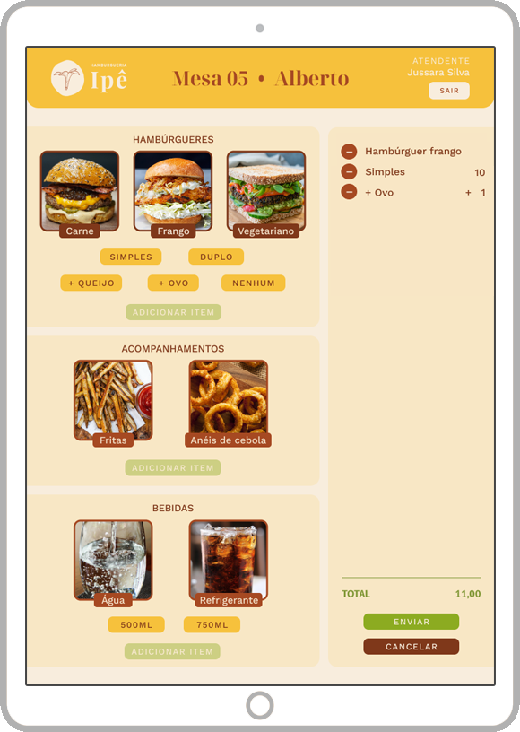</img>
</div> 

🔎 *Clique nas imagens para ampliar*

<div id='feedback-melhorias'>

### 6.2 Feedback & Melhorias
</div>

<div align="center">
  
  </img>
</div>


🔄 O feedback que recebemos dos usuários foi muito positivo no geral.
A interface visual foi absolutamente elogiada pela beleza, cores agradáveis e em sintonia, além da facilidade para leitura de todos os textos. 

Ainda assim, durante as entrevistas e testes, percebemos que o botão "**Adicionar Item**" prejudicava a experiência, pois tornava a navegação confusa e improdutiva, exigindo que eles dedicassem uma quantidade razoável de tempo para utilizar a aplicação.

Removemos o botão e optamos por mudar a cor de fundo para tentar facilitar a navegação por meio de cores:

<div align="center">
  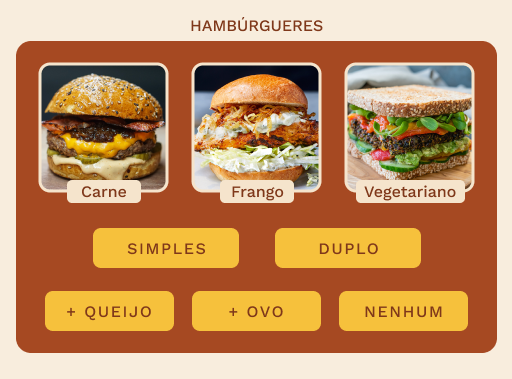</img>
</div>

Os usuários continuaram confusos 🙃

Oferecemos uma nova solução: **Transformar as fotos dos itens em [radio buttons](https://pt.wikipedia.org/wiki/Bot%C3%A3o_de_op%C3%A7%C3%A3o).**

Quando o atendente clica em cada botão ou foto, o item muda de cor e é automaticamente adicionado a coluna de itens que monta o pedido.

<div align="center">
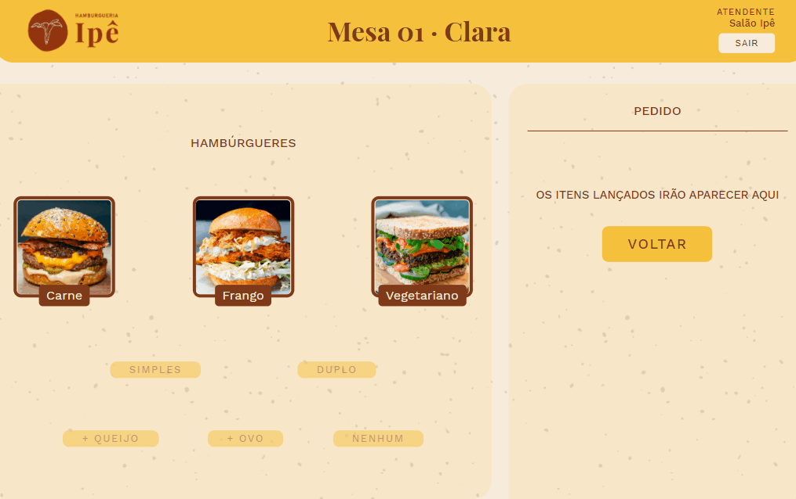</img>
</div>

Essa solução agradou aos usuários e tornou a tarefa de montar pedido mais eficiente.

🔄 Outra funcionalidade que precisou de uma pequena melhoria, foi a coluna que armazena os itens selecionados pelo atendente. Alguns usuários tiveram dificuldade de entender claramente como funcionava.
Na nova versão, deixamos ela mais *clean*:

<div align="center">
  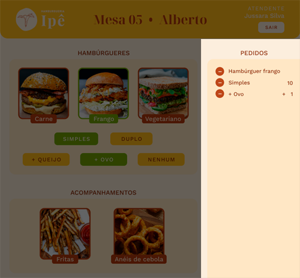</img> &nbsp; 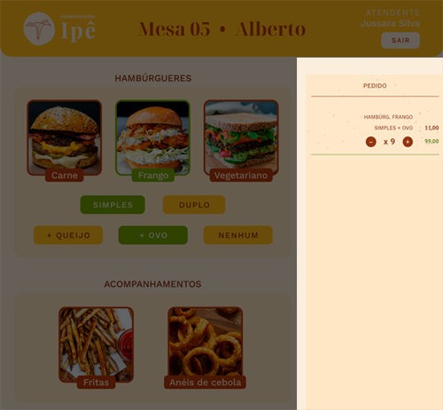</img>
</div>

🔎 *Clique nas imagens para ampliar*

As soluções foram aplicadas e a versão final do *wireframe* foi bem aceita pelos usuários.

  <div align="center">
    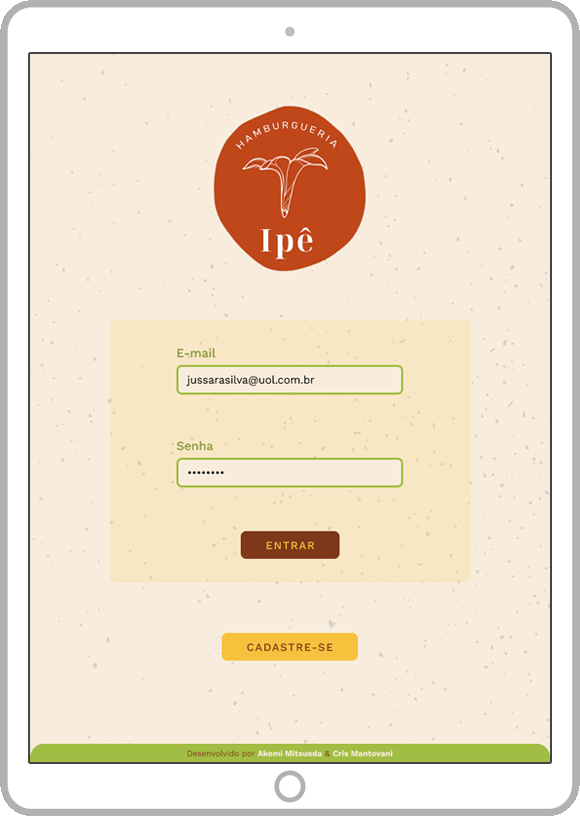</img> &nbsp; 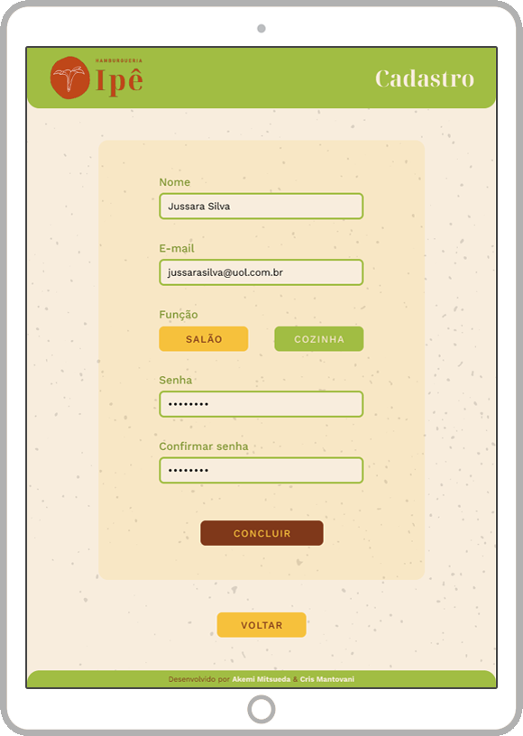</img>
    <br/><br/>
    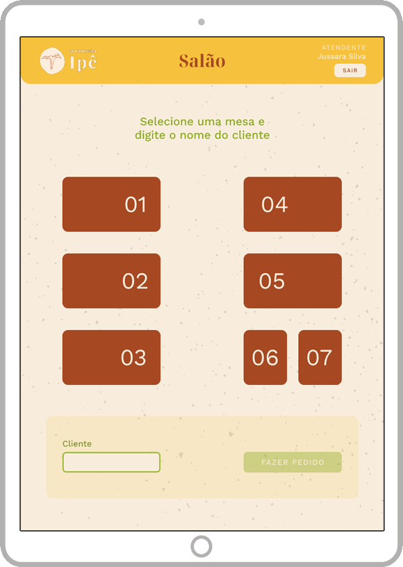</img> &nbsp; </img>

🔎 *Clique nas imagens para ampliar*
  </div> 

<p align='right'><a href='#topo'>🚀 Voltar ao topo</a></p>

## 7. Desenvolvimento

🛠️ Com toda a identidade visual definida, UX & UI plenamente satisfatórios, começamos a desenvolver a interface da Hamburgueria Ipê.
Os principais objetivos foram definidos logo de início:

🧾 A aplicação foi desenvolvida como SPA ([*single-page application*](https://en.wikipedia.org/wiki/Single-page_application)), para que o usuário tenha a experiência similar à de um aplicativo para *desktop*.

📱 Como o ambiente é uma hamburgueria, a aplicação é 100% responsiva para *tablets* utilizados na **vertical**.

🧩 Utilizamos React JS para componentizar todo o site. Isso mantém a aplicação com alto desempenho e também permite que os componentes sejam reutilizados, gerando um código de fácil manutenção por qualquer desenvolvedor.

✨ Instalamos o [ESLint](https://www.npmjs.com/package/eslint) na aplicação para manter o código padronizado e pronto para ser testado.

### 7.2 Interface Final
💫 Depois de três [*sprints*](https://www.projectbuilder.com.br/blog/scrum-o-que-e-sprint-e-como-executa-lo/), apresentamos a interface final da aplicação e todas as suas funcionalidades:

<div align='center'>

| Salão 	| Cozinha 	|
|:-----:	|:-------:	|
|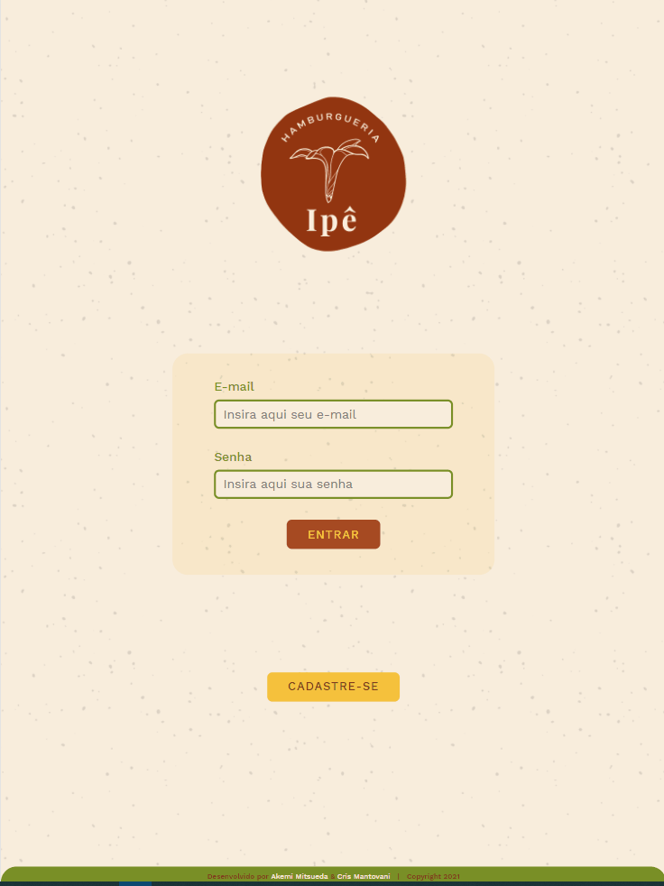</img> | 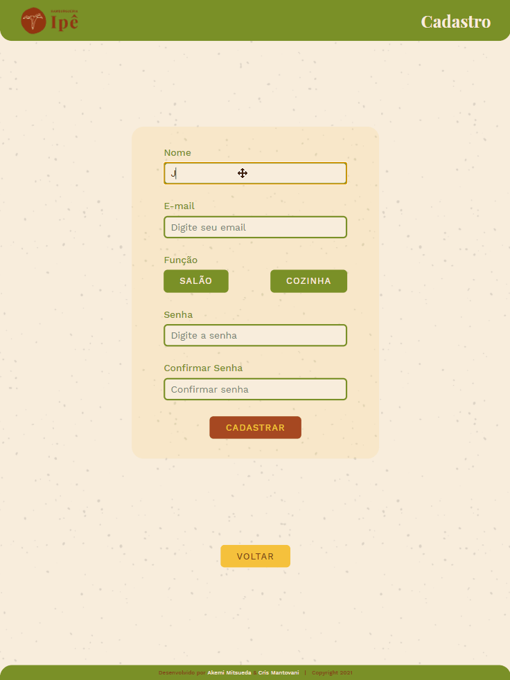</img>	|

<h3>iPad </h3>

  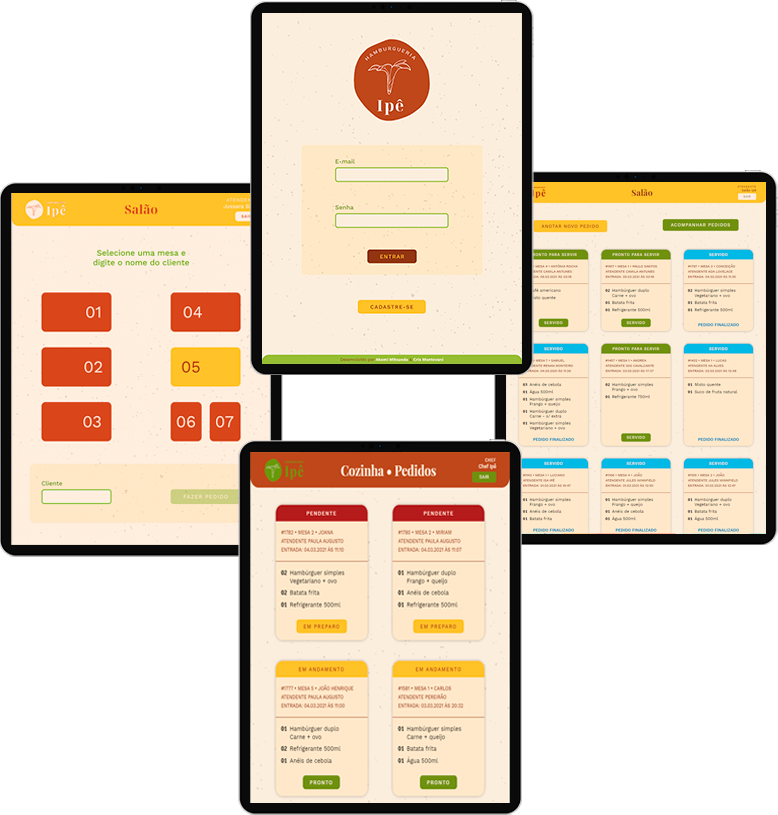
</div>

🔎 *Clique nas imagens para ampliar*

Toda a aplicação foi aprovada 100% pelo cliente e seus usuários.

<div id='roi'>

### 7.3 Valor do produto (R.O.I)
</div>

💲 Para que a Hamburgueria Ipê continue crescendo e pensando em futuras expansões, implementamos uma *feature* para auxiliar no R.O.I ([Return Over Investment](https://pt.wikipedia.org/wiki/Retorno_sobre_o_investimento)).

Os pedidos ficam armazenados na [API](https://www.redhat.com/pt-br/topics/api/what-are-application-programming-interfaces) após finalizados.
Isso abre a possibilidade da equipe de [*back-end*](https://www.alura.com.br/artigos/o-que-e-front-end-e-back-end) utilizar esses dados para uma análise profunda de dados como:

💡 Eficiência da cozinha e do salão

💡 Melhor controle de estoque

💡 Planejar novas filiais

💡 Estratégia para promoções mais eficientes

💡 Comportamento do cliente

Entre diversos outros benefícios que a análise de dados pode oferecer!

<div id='futuro'>

### 7.4 Próximos passos
</div>

🧙‍♀️ A aplicação está completa e funcional, mas sempre é possível melhorar no futuro.

Nossas metas para o futuro são:

- [ ] Retornar mensagens de erro para cada ação do usuário
- [ ] Aplicar loading em todas as páginas necessárias
- [ ] Melhoras gerais na API
- [ ] Favicon
- [ ] Calcular automaticamente o tempo de preparo dos pedidos
- [ ] Responsividade para desktop e mobile
- [ ] 70% de cobertura em testes

⚠️ Essa lista pode aumentar a qualquer momento :D

<p align='right'><a href='#topo'>🚀 Voltar ao topo</a></p>

## 8. Tecnologias

Hamburgueria Ipê utiliza as seguintes ferramentas:

**Code:**

[](https://pt-br.reactjs.org/) [](https://html5.org/) [](https://www.w3.org/Style/CSS/Overview.en.html) [](https://developer.mozilla.org/pt-BR/docs/Web/JavaScript) [](https://nodejs.org/en/) [](https://vercel.com/)

**Planejamento:**

[](https://trello.com/) [](https://www.figma.com/) [](https://www.canva.com/)

📦 Fique à vontade para rodar o projeto localmente. É bem simples!

**1 -** Clone o repositório para seu local

<p align='center'>
  </img>
</p>

**2 -** Instale o [Node.JS](https://nodejs.org/en/)

**3 -** Abra o terminal e instale o [NPM](https://www.npmjs.com/get-npm)

```js ('*.js')  
npm install
```

**4 -** Entre na pasta raiz do projeto e digite:

```
npm start
```

🖥️ Os ambientes suportados são: 
<div align='center'>

|</img> | </img>| </img>|</img>	|</img>|          	
| :-----------:	| :---------: | :---------: | :--------: | :-------:|
|   IE / Edge	  |    Firefox  |    Chrome   |   Safari   |  Opera 	|
|   Versão 89 + | Versão 89 + | Versão 89 +	| 13 ou 14 + |    74 +  |

</div>

Enjoy 👊

<p align='right'><a href='#topo'>🚀 Voltar ao topo</a></p>

## 9. Desenvolvedoras

  <div align="center">
    
    </img>
  </div>

👩‍💻 Hamburgueria Ipê foi orgulhosamente desenvolvido em 4 semanas,  por Akemi Mitsueda e Cris Mantovani, alunas da SAP005 do *bootcamp* da [Laboratória](https://github.com/Laboratoria).
 
 Se você ficou com alguma dúvida, tem sugestões ou quer apenas nos conhecer melhor, por favor, entre em contato :)
 
 <div align='center'>

|                              Akemi Mitsueda                             	      |                                 Cris Mantovani                                 	|
|:------------------------------------------------------------------------------: |:------------------------------------------------------------------------------:	|
|</img> | </img> 	|
| <a href='https://github.com/akemimeka'></img></a> <a href='https://www.linkedin.com/in/akemimeka/'></img></a>  |  <a href='https://github.com/crismantovani'></img></a> <a href='https://www.linkedin.com/in/crissmantovani/'></img></a> 	|          	|
</div>

### 10. Licença

  <div align="center">
    
    </img>
  </div>

**© 2021 - Alguns direitos reservados**

🔴 **NUNCA** use de forma comercial!

🟡 **SEMPRE** que for compartilhar essa aplicação, dê os créditos!

🟢 **NÃO** altere e nem crie derivados dessa aplicação se for para uso público!

Quer pedir uma exceção? Entre em contato antes!

Mais detalhes da licença [clicando aqui](https://creativecommons.org/licenses/by-nc-nd/4.0/deed.pt_BR).

<p align='right'><a href='#topo'>🚀 Voltar ao topo</a></p>

