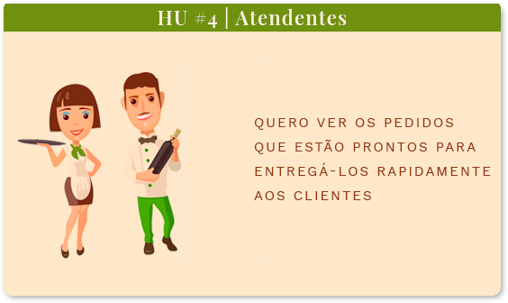

  </img>
  <h1>Hamburgueria Ipê</h1>

## ⚛️ :fork_and_knife:	:iphone: :chart:	 🚀
### Original,  minimalista e <i>clean</i>

Hamburgueria Ipê é uma aplicação para <i>tablets</i> baseada em  ReactJS, JSX e CSS3.
#### :speaking_head: User Experience (UX)
- Exaustivamente testado para atingir a melhor experiência do usuário
#### :art: Design original
- Identidade visual agradável e de fácil identificação das <i>features</i>
#### 🧩 Componentização
- A aplicação está toda componentizada para fácil manutenção do código
#### 🗂️ Documentação
- Todo o processo está bem documentado para melhor entendimento
#### 📊 Data Science
- Possibilidade de levantar dados para o desenvolvimento do negócio
## :earth_africa: Acesse a aplicação

  </img>

 
<h4> Você pode acessar a aplicação <a href="http://hamburgueria-ipe.vercel.app/">clicando aqui</a> e utilizar um dos logins de teste abaixo:</h4>

| #                     	|             Salão            	|           Cozinha           	|
|:-----------------------:|:----------------------------:	|:---------------------------:	|
| :busts_in_silhouette: 	| salao@hamburgueriaipe.com.br 	| chef@hamburgueriaipe.com.br 	|
| :key:                 	|            123456            	|            123456           	|

 
 ***
## :bookmark_tabs: Índice

<!--ts-->

* [1. O Projeto](#1-o-projeto)
* [2. A aplicação](#2-a-aplicação)
* [3. Histórias de usuários](#3-histórias-de-usuários)
    * [3.1 Funcionalidades](#31-funcionalidades)
* [4. Planejamento](#4-planejamento)
    * [4.1 Organização](#41-organização)
    * [4.2 Fluxograma](#42-fluxograma)
    * [4.3 User Experience](#43-user-experience)
    * [4.4 Wireframe de média fidelidade](#44-wireframe-de-média-fidelidade)
* [5. Identidadade Visual](#5-identidade-visual)
    * [5.1 Paleta de Cores](#51-paleta-de-cores) 
    * [5.2 Fontes](#52-fontes)
    * [5.3 Logotipo](#53-logotipo)

<!--te-->
***
## 1. O Projeto
O desafio *Burguer Queen* proposto pela [Laboratória](https://github.com/Laboratoria), é de desenvolver uma interface para uma hamburgueria 24hrs que está em expansão.
Premissas:
- Manter a interface e o estado sincronizados com React
- Ser um SPA (Single Page App)
- Ser responsivo em *tablets*
- Definir a estrutura de pastas e arquivos
- Usar JavaScript (ES6+) para a lógica do projeto

## 2. A aplicação
  

    
    </img>
  

A Hamburgueria Ipê lançou o serviço de 24 horas e foi muito bem aceito pelos clientes. Agora, a prioridade é continuar crescendo sem perder a qualidade.

Para isso, o atendimento deve ser simples e rápido, a cozinha deve ser eficiente e o negócio deve ser gerenciado com base em dados reais e relatórios fáceis de entender.

## 3. Histórias de usuários

A Hamburgueria Ipê nos forneceu as histórias de usuários:

:writing_hand: **História de usuário #1**

  

    
    </img>
  

:writing_hand: **História de usuário #2**

  

    
    </img>
  

:writing_hand: **História de usuário #3**

  

    
    </img>
  

:writing_hand: **História de usuário #4**

  

    
    </img>
  

  
 ### 3.1 Funcionalidades
Com base nas histórias dos usuários, definimos algumas funcionalidades para a aplicação:

|              HU #1 :heavy_check_mark:              	|           HU #2 :heavy_check_mark:          	|           HU #3 :heavy_check_mark:           	|          HU #4 :heavy_check_mark:          	|
|:--------------------------------------------------:	|:-------------------------------------------:	|:--------------------------------------------:	|:------------------------------------------:	|
|                 Criar login e senha                	|       Anotar nome do cliente e a mesa       	|            Ver os pedidos em ordem           	| Ver a lista de pedidos prontos para servir 	|
| Registar usuário conforme setor (cozinha ou salão) 	| Adicionar e/ou excluir produtos aos pedidos 	| Marcar pedido como 'PRONTO' para ser servido 	|    Marque os pedidos que foram entregues   	|
|            Fazer login na tela correta             	|     Ver resumo e o valor total do pedido    	| Ver o tempo que levou para preparar o pedido 	|                                            	|
|                                                    	|        Enviar o pedido para a cozinha       	|                                              	|                                            	|

##  4. Planejamento
🖍️	Todo o conceito do projeto envolveu uma enorme valorização da experiência do usuário e suas necessidades. Também planejamos e estudamos as opções disponíveis antes de apresentar a solução para a Hamburgueria Ipê.

#### 	4.1 Organização
  

  

:memo:  Para conseguir entregar todas as funcionalidades do projeto, organizamos todo o fluxo de desenvolvimento do projeto pelo método [Kanban](https://pt.wikipedia.org/wiki/Kanban) no Trello. 

Dessa forma, definimos:

:seedling: [MVP](https://pt.wikipedia.org/wiki/Produto_vi%C3%A1vel_m%C3%ADnimo)

:call_me_hand: Critérios mínimos de aceitação

:label: Padronizações do código ([Code Style](https://en.wikipedia.org/wiki/Programming_style))

:hammer_and_pick:  Divisão de tarefas

🤝 [Daily Scrum](https://www.desenvolvimentoagil.com.br/scrum/daily_scrum)

  

    
    </img>
    
🔎 *Clique na imagem para ampliar*
  

### 4.2 Fluxograma

🧭 Com as histórias de usuário, conseguimos entender as necessidades da Hamburgueria Ipê e montar o fluxo da aplicação

🔎 *Clique na imagem para ampliar*
 

 

### 4.3 User Experience
🤩	Durante o processo de criação, fizemos diversas entrevistas com usuários para começar a desenvolver o [*wireframe*](https://pt.wikipedia.org/wiki/Website_wireframe) de média fidelidade no [Figma](https://www.figma.com/) e atender as necessidades do usuário entregando uma boa experiência.

:warning:	As entrevistas foram realizadas por vídeo conferência devido a pandemia do Coronavírus.

### 4.4 Wireframe de média fidelidade
🔰 Com as respostas dos usuários, conseguimos desenvolver e testar o protótipo de média fidelidade, que pode ser acessado [clicando aqui](https://www.figma.com/proto/5rVNETEzDOLBWddlkh2iUo/Hamburgueria-Ip%C3%AA?node-id=1%3A2&scaling=min-zoom).

  

    </img> </img>
     
    </img> </img>
    
🔎 *Clique nas imagens para ampliar*
  
 

## 5. Identidade Visual
🖌️ O conceito da identidade visual da hamburgueria envolve as cores do Brasil e da típica árvore Ipê Amarelo e sua flor:

</img>

### 5.1 Paleta de Cores
👩‍🎨 A paleta de cores foi desenvolvida com tons de verde e amarelo  presentes na bandeira do Brasil e da flor Ipê, e, alguns tons terrosos como da árvore

Fizemos entrevistas com os usuários para alcançarmos tons que entregassem a melhor e mais agradável visualização.

🔎 *Clique na imagem para ampliar*

### 5.2 Fontes
✒️ Testamos e escolhemos três fontes para a interface

### 5.3 Logotipo

A partir da definição da paleta de cores, criamos um logotipo adequado a interface visual da hamburgueria.

   

    </img>
  

 #### Interface Alta Fidelidade

  

    </img>
  

   

    </img>
  

#### Página do menu principal
Atendente executando pedido
 

    </img>
  

  
 

    </img>
  

 
  🔎 Usabilidade

 Realizamos entrevistas e testes com os usuários até chegar na melhor usabilidade da aplicação.
 Em alguns testes, identificamos que:

 ⚠️ Os atendentes precisavam que as cores dos itens mudassem ao realizar pedidos
 
 ✔️ Solução: Criamos input radios que alteram a cor após o clique

## ⚒️ Tecnologias

Hamburgueria Ipê utiliza as seguintes ferramentas:

 **Code:**
 
      

**Planejamento:**

  

## 7. Desenvolvedoras

  

    </img>
  

Hamburgueria Ipê foi orgulhosamente desenvolvido em 4 semanas,  por Akemi Mitsueda e Cris Mantovani, alunas da SAP005 do *bootcamp* da [Laboratória](https://github.com/Laboratoria).
 
 Se você ficou com alguma dúvida, tem sugestões ou quer apenas nos conhecer melhor, por favor, entre em contato :)
 
 

 
 | Akemi Mitsueda                                                             |                            Cris Mantovani               |
 | :-------------------------------------------------------------------------:| :-----------------------------------------------------: |
 |  |                                                                              |
 |   |   |
 

Copyright [year] [fullname]	
